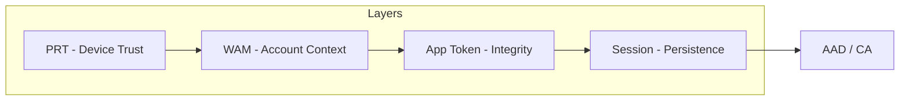

# 🔐 Windows Authentication Flow Framework

## 🎯 Purpose

> [!NOTE]
> This repository documents a practical model to understand and troubleshoot the Windows authentication chain from device identity to cloud policy enforcement.

It is not a product and not a tool collection. It is a **thinking framework** that grew out of real support incidents where standard fixes worked inconsistently or not at all.

The goal is simple: **make authentication state readable, traceable, and resettable** without blind trial and error.

---

## 🕒 How This Started

The work began with a set of PowerShell repair scripts (`OutlookReset.ps1`, `TeamsReset.ps1`, `WAMCleanup.ps1`).

Each script appeared to fix a different symptom:
- **Outlook** shows a license but behaves as unlicensed
- **Teams** refuses to sign in
- **Edge SSO** breaks selectively

Over time it became clear that these were not separate problems. They were different expressions of the **same underlying issue**: authentication state drift.

---

## 🏗️ The Layer Model (A–D)

The authentication chain is treated as four distinct layers. Each layer has its own persistence, failure modes, and safe reset boundaries.

| Layer | Scope | Description | Typical Validation / Reset |
| :---: | :--- | :--- | :--- |
| **A** | **Identity Token** | Device join state, PRT validity, Azure AD trust | `dsregcmd /status`, device rejoin |
| **B** | **WAM Store** | Web Account Manager state (user + device context) | WAM reset, `runDll32.exe keymgr.dll,KRShowKeyMgr` |
| **C** | **App Tokens** | MSAL / OneAuth caches, per-app token persistence | Targeted cache cleanup |
| **D** | **Session Layer** | WebView2, browser cookies, session binding | Browser / WebView2 reset |

> [!TIP]
> Each layer can fail independently. Symptoms often surface in applications, but the break occurs earlier in the chain. The model is used to map: **symptom → layer → lowest-risk intervention**.

---

## 🛡️ Support Competence Boundaries

The model also defines *who* should touch *which* layer.

| Level | Responsibility | Access Scope |
| :--- | :--- | :--- |
| **1st Line** | Guided resets following predefined paths | User context only |
| **2nd Line** | Layer-specific validation and correction | Local admin, logs |
| **3rd Line** | Correlation with Conditional Access and directory state | Azure AD / directory access |

> [!IMPORTANT]
> Clear boundaries reduce accidental damage and prevent over-resetting systems that only require localized correction.

---

## 🔄 Authentication Flow Overview

### 🖼️ Visual References
- [Authentication Flow Overview](diagrams/auth-flow-overview.svg)
- [Common Failure Map](diagrams/failure-map.svg)

---

## 🐚 Relation to the User Execution Shell (UES)

This repository focuses strictly on authentication state. It fits into a broader concept called the **User Execution Shell (UES)**: the persistent runtime boundary created when a user signs in.

The UES is not a token store or a login event. It is the environment in which identity, policy, and running processes remain bound over time.

This repository describes how authentication flows through that shell.

> [!NOTE]
> A concise description of the UES concept is available in: [docs/ues-context.md](docs/ues-context.md)

---

## ⚠️ What This Is Not

- ❌ Not an official Microsoft model
- ❌ Not a replacement for documentation
- ❌ Not a universal fix-it guide

It is a structured way to think about failures that otherwise appear random.

---

## 🚦 Status

**Work in progress.** The model evolves as new failure patterns emerge.
