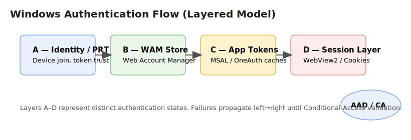
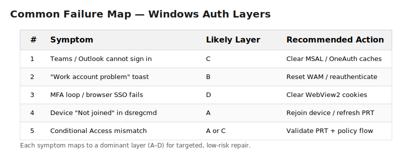

---

# 🔧 **2. Visual Sketch (Markdown / ASCII diagram)**

This diagram fits inside the whitepaper (`docs/auth-flow-mini-whitepaper.md`):

```markdown
## 🔄 Authentication Chain Overview (Concept Diagram)

```text
        +---------------------+
        |   Conditional Access |
        +----------^----------+
                   |
                   |
    +--------------+------------------+
    |         Token Flow Chain        |
    +---------------------------------+
    |   A   |   B   |    C    |   D   |
    |-------|-------|---------|-------|
    |  PRT  |  WAM  | MSAL/   | Edge  |
    |       | Store | OneAuth | WebV2 |
    +---------------------------------+
      |         |         |       |
      v         v         v       v
   Device   Account   App Token  Session
   Trust    Context   Cache      State

```





## Relation to UEC

This repository is a focused building block inside the broader UEC context.  
UEC treats the Windows authentication flow as a controllable subsystem: measurable inputs, safe interventions, auditable outputs.  
See **docs/uec-context.md** for interfaces (signals in/out), control points (A–D), and how this map is used in operations and automation.
