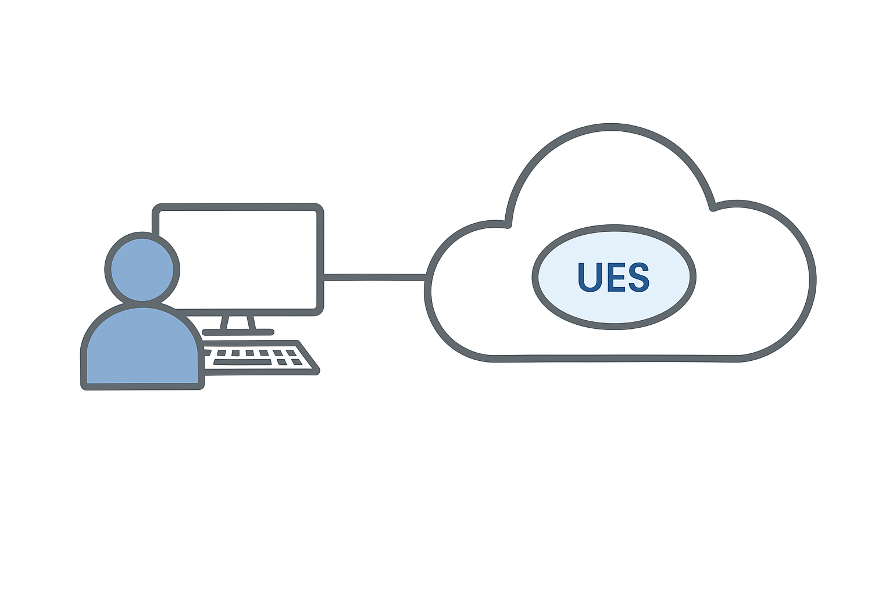

# 🐚 User Execution Shell (UES)

## 📝 Definition

> [!NOTE]
> The User Execution Shell (UES) is the persistent operational state created when a user signs in.

It is not a login event and not a token container. It is the **runtime boundary** in which identity, policy, and running processes remain bound over time.

As long as this boundary stays intact, authentication behaves predictably. When it degrades, systems may remain formally authenticated while becoming operationally unstable.

---

## 💡 Concept

After sign-in, user activity does not occur in isolation. It runs inside a coherent shell that holds:

- 🆔 **Authenticated identity state** (PRT, WAM)
- 🔗 **Device and session bindings**
- 🛡️ **Policy context** (Conditional Access, compliance)
- 💻 **Active execution surface** (applications, brokers, WebView2)

This shell persists across application launches and token renewals. It is the **continuity layer** between authentication and execution.

> [!TIP]
> When the shell remains consistent, token renewal and sign-in flows are largely invisible. When it fractures (profile resets, token drift, VDI rehydration), authentication starts to decay even though credentials may still be valid.

---

## 🔗 Relation to the Authentication Flow

Authentication is not separate from the UES. It is the mechanism that keeps the shell coherent.

| Component | Role inside the UES |
| :--- | :--- |
| **Device / Logon** | Creates the shell and establishes base trust |
| **PRT / WAM** | Maintains identity continuity inside the shell |
| **MSAL / OneAuth** | Issues delegated tokens to processes |
| **Conditional Access** | Evaluates actions leaving the shell |

The authentication flow continuously refreshes and validates the shell. If that flow stalls or desynchronizes, the shell remains present but loses integrity.

---

## 🔍 Failure Characteristics

Typical failure patterns observed at the UES level:

- ❗ Credentials valid, but applications behave as unauthenticated
- ❗ Selective sign-in failures across apps
- ❗ Licenses visible but UI or account state degraded
- ❗ Fixes working temporarily and regressing later

In these cases, the issue is rarely a single token. It is usually a **broken relationship** between layers inside the shell.

---

## 🎯 Scope

This repository documents the authentication components operating *within* the User Execution Shell.

Other concerns such as:
- 🔄 Lifecycle control
- 📊 State diffing
- 📈 Telemetry and observability
- 🧹 Controlled teardown and reinitialization

...are treated as separate modules that operate *around* the UES rather than inside it.

---

### 📂 External References
- [Main Framework Overview](file:///d:/DEV/projects/windows-auth-flow/README.md)
- [Authentication Flow Mini-Whitepaper](file:///d:/DEV/projects/windows-auth-flow/docs/auth-flow-mini-whitepaper.md)
